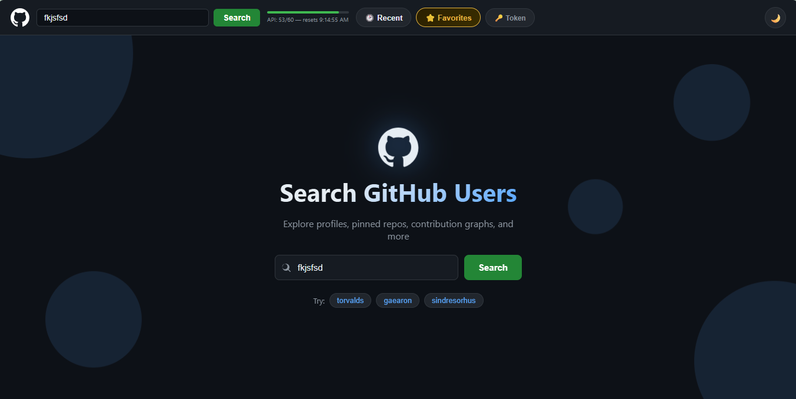

# 🔍 GitHub User Search

A fast, clean, and feature-rich GitHub profile explorer built with vanilla HTML, CSS, and JavaScript — no frameworks, no dependencies beyond Chart.js.



Live demo: [bereketkefeni-creator.github.io/github-user-search](https://bereketkefeni-creator.github.io/Github-user-search)

---

## ✨ Features

- **Profile Explorer** — View avatar, bio, location, company, website, and Twitter
- **Animated Stats** — Followers, following, repos, and gists count up on load
- **Real Pinned Repositories** — Fetches actual pinned repos via GitHub GraphQL API (requires token)
- **Contribution Calendar** — Full year heatmap just like GitHub's (requires token)
- **Language Chart** — Doughnut chart of all languages used across public repos
- **Repository List** — Search, sort, and filter repos with a hide-forks toggle
- **Recent Searches** — Saves last 10 searches to localStorage
- **Favorites** — Star any profile and access it instantly from the navbar
- **API Rate Limit Bar** — Live indicator showing remaining GitHub API calls
- **GitHub Token Support** — Add a personal access token to unlock 5,000 req/hr + GraphQL features
- **Share Button** — Copies a direct profile link to clipboard
- **Dark / Light Mode** — Smooth theme toggle with full support across all components
- **Skeleton Loading** — Shimmer placeholders while data loads
- **Shareable URLs** — Every search updates the URL (`?user=torvalds`) for easy sharing
- **Fully Responsive** — Works on mobile, tablet, and desktop

---

## 🚀 Getting Started

No installation needed. Just open `index.html` in your browser.

```bash
git clone https://github.com/bereketkefeni-creator/github-user-search.git
cd github-user-search
open index.html
```

---

## 🔑 Unlocking Full Features (Optional)

By default the app uses GitHub's public API (60 requests/hour, no GraphQL).

To unlock everything:

1. Go to [github.com/settings/tokens](https://github.com/settings/tokens)
2. Generate a classic token with `read:user` scope
3. Click the **🔑 Token** button in the navbar
4. Paste your token and hit **Save Token**

This enables:
- ✅ Real pinned repositories (via GraphQL)
- ✅ Contribution calendar heatmap
- ✅ 5,000 API requests per hour

> Your token is stored locally in your browser and never sent anywhere except directly to GitHub's API.

---

## 🛠 Built With

| Technology | Purpose |
|---|---|
| HTML5 | Structure |
| CSS3 | Styling, animations, responsive layout |
| Vanilla JavaScript | Logic, API calls, localStorage |
| GitHub REST API v3 | User data, repositories |
| GitHub GraphQL API v4 | Pinned repos, contribution calendar |
| Chart.js | Language doughnut chart |

---

## 📁 Project Structure

```
github-user-search/
├── index.html      # App structure and markup
├── style.css       # All styles, themes, and animations
├── script.js       # All logic, API calls, and interactions
└── README.md       # You are here
```

---

## 👤 Author

**Bereket Kefeni**
GitHub: [@bereketkefeni-creator](https://github.com/bereketkefeni-creator)

---

## 📄 License

This project is open source and available under the [MIT License](LICENSE).
